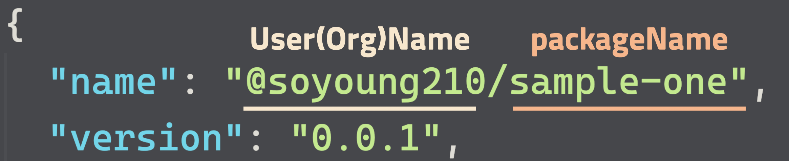

# Lerna, Rollup, TypeScript, GitHub Packages

Building a mono repo package environment using [Lerna](https://lerna.js.org/), [Rollup](https://rollupjs.org/), [TypeScript](https://www.typescriptlang.org/index.html), [semantic-release-monorepo](https://github.com/pmowrer/semantic-release-monorepo) and [GitHub Packages](https://help.github.com/en/packages/publishing-and-managing-packages/about-github-packages).

## 🎩 Build Output

```markdown
packages/sample-one
+-- dist
|   +-- esm
|      +-- index.js
|      +-- index.js.map
|      +-- main.js.map
|   +-- cjs
|      +-- index.js
+--    +-- index.js.map
```

## 🔫 Trouble Shooting

### Type Definition

We use [ttypescript](https://github.com/cevek/ttypescript/) and [typescript-transform-paths](https://github.com/LeDDGroup/typescript-transform-paths) due to path reference problem in `index.d.ts` file when using absolute path in the packages.(eg, sample-one, sample-two)

### GitHub Package Registry

`.npmrc`file must be added to the root of the project.

```bash
@soyoung210:registry=https://npm.pkg.github.com/soyoung210
```

### Check Your Package name

The package name should follow the format:


